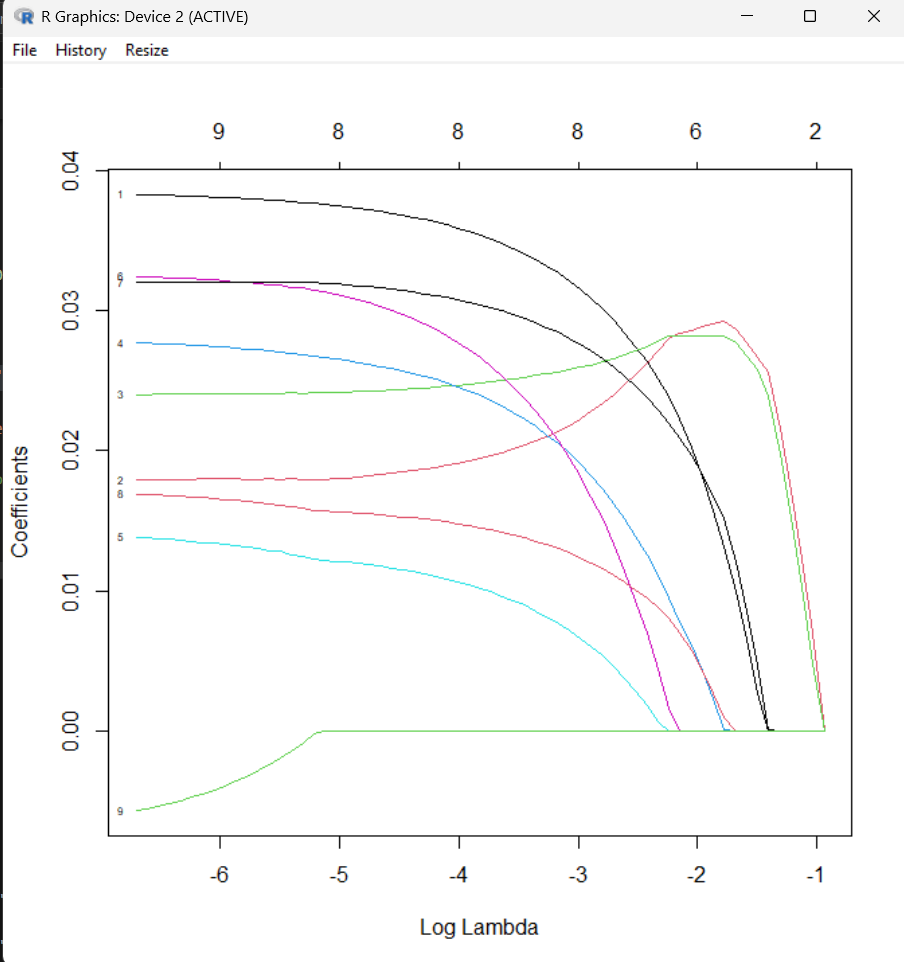
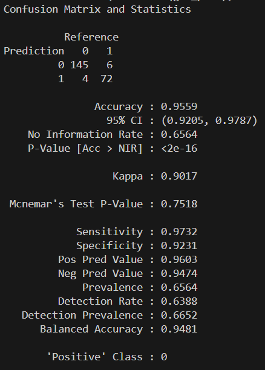
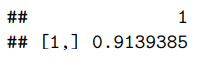

# Machine Learning Medicine utilizando R

## Descripcion
Se utilizará un conjunto de datos del Breast Cancer Wisconsin Diagnostic Data Set, disponible públicamente en el repositorio UCI. Contiene 699 muestras obtenidas mediante aspiración con aguja fina (FNA) de masas mamarias, recolectadas entre 1989 y 1991.

## Importacion y la preparacion para el conjunto de datos
Se importan el conjunto de dats de cancer para el repositorio de la UCI.

Para luego se puedan modificar los datos reevaluando los datos que hacen falta, estos pueden mostrarse como '?' y se pasaran a NA, esto eliminara las filas con datos faltantes y se reevaluaran las calses con 2 y 4 y se pasaran a 0 y 1, donde 0 indica que el tumera era benigno y el 1 indica que era maligno.

Este conjunto de datos se representa facilmente en una matriz, es decir, una tabla como se mostrara en el codigo, cada fila contiene una instancia individual. Las caracteristicas que componen el conjunto de datos de entrenamiento pueden describirse como entradas y se denotan como el conjunto x y los resultados pueden denorminarse como clase y se denotan en el conjunto y.

Ya que el modelo debe de entrenarse el conjunto de datos se dividira en dos segmentos: uno que contiene el 67% dl conjunto de datos para el entrenamiento, y e otro, que se utilizara pra la evaluacion y contiene el 33% restante.

## Entrenamiento de los Modelos

Ya que el conjunto de datos esta en un formato adecuado, se podra comenzar con el entrenamiento del algoritmo para el modelo, para fines de este articulo solo se usara el algoritmo de Regresion logistica utilizando modelos generalizados (GML) con reguralizacion LASSO (operador de seleccion y contraccion minimo absoluto) ya que los conjuntos de datos utilizados tienen un gran número de características incluidas al modelo, la regularizacion reduce efectivamente este exceso, lo qu elo hace especialmente adecuado para grandes conjutnos de datos que pueden tener mas características que instancias.

Para implementer GML en R, se utiliza el paquete glmnet, donde el parámetro de regularización se seleccona mediante el valor numefico de alfa, un valor numérico de 1 seleccionará LASSO que es el que necesitamos.

Luego la validación nFold se utiliza par determina el valor óptimo de lambda o parámetro de regularización. Este valor que minimiza el error de predicción se almacena en el objeto ` glm_model$lambda.min `. Cuanto menor se el numero de lambda mayor el efecto de regularizacion sobre el númer de características en el modelo y sus respectivos coeficientes. 

Luego para probar el rendimiento de los algoritmos ya entrenados se conparan las predicciones con datos distintos a lo que se utilizaron para el entrenamiento estos serian resultados reales. Para eso en R se crea un vector de predicciones del modelo utilizando la matriz ` x_test `, que puede compararse con ` vectory_test ` para asi establecer métricas de rendimiento, luego se utiliza la función ` predict() `, incluida en el paquete ` stats ` de la distribucion de R.

` glm_pred = round(predict(glm_model, x_test, type="response"),0)  `

## Matriz de confusion
Los datos clasificados suelen representarse en una matriz de confusion donde las clasificaciones realizadas por el algoritmo se comparan con las clasificaciones reales (a las que le algoritmo no tiene acceso). Una vez rellena la matriz, esta proporciona toda la informacion necesaria para calcular manualmente la sensibilidad, la especificidad y la precision.

En R el paquete caret contiene la funcion ` confusionMatrix() ` la cual crea la matriz de confusion y calcula la sensibilidad, especificidad y precision. Esta funcion requiere una entrada binaria para los predictores, y la funcion `glm_pred() ` utilizada en el codigo generan un vector de valores entre 0 y 1, donde un valor mayor refleja mayor certeza. 

## Aplicacion de nuevos datos a los modelos entrenados

Los modelos estan diseñados para no inferir las relaciones entre variables, sino mas bien para realizar predicciones fiables a partir de nuevos datos.
Para usar los modelos ya entrenados y relizar predicciones a partir de los nuevos datos, se necesita construir un vector si es que hay solo un caso nuevo o una matriz para varios. Se asegura de que los nuevos datos se ingresen en el modelo en el mismo orden que en las matrices ` x_train ` y ` x_test ` . Para este ejemplo se ingresan nuevos datos para el tamaño de la celula, forma, adhesión, tamaño epitelial, entre otros. Lo cual se refleja en la parte final del codigo.

El valor para la regularizacion es 0.09139385, lo que indica que este valor minimiza  el error y mantiene la simplicidad del modelo lo que proporciona predicción mas acertada utilizando los nuevos datos. 